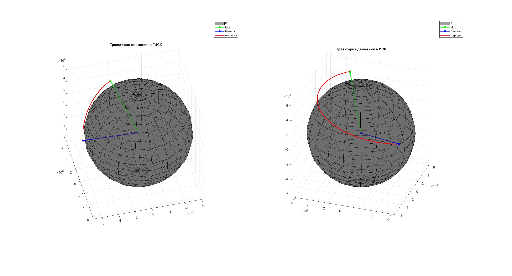

# Алгоритм построения траектории

**Дано:**  
1. Начальная точка $M_0(\phi_0, \lambda_0 )$ и конечная точка $M_1(\phi_1, \lambda_1 )$ на окружности ортодромии;
2. Модуль абсолютной путевой скорости $W$ точки $M_\tau(\phi_\tau, \lambda_\tau )$ при движении от $M_0$ до $M_1$
3. Абсолютная высота точки $H$ над сферой, равной среднему радиусу Земли.  

*Примечание:* $\phi_i, \lambda_i$ - Гео**Ц**ентрические координаты ($\lambda \equiv L$).  

**Найти:**  
 Координаты точки $M_i(\phi_i, \lambda_i )$ на интервале $t=(0, t_k)$ в ГИСК и ИСК.  

Проект реализует расчёт и визуализацию траектории движения точки между двумя географическими координатами на высоте над сферической моделью Земли.

## Описание алгоритма

Реализация находится в `matlab/main.m`.

1. Начальные данные:
   - начальная точка $M_0(\phi_0, \lambda_0)$ и конечная точка $M_1(\phi_1, \lambda_1)$ в градусах;
   - путевая скорость $W$ в метрах в секунду;
   - высота $h$ над сферой Земли ($R_{\text{earth}} = 6371000\ \text{м}$);
   - частота записи $\text{Hz}$.

2. Преобразование:
   - перевод координат из градусов в радианы;
   - перевод широты/долготы в декартовы векторы в системе ГИСК на высоте $R_{\text{earth}} + h$.

3. Расчёт траектории:
   - вычисление центрального угла $\alpha$ между векторами $\mathbf{e}_0$ и $\mathbf{e}_1$;
   - нормировка оси вращения $\mathbf{e}_c = \mathbf{e}_0 \times \mathbf{e}_1$;
   - длина маршрута $L = (R_{\text{earth}} + h)\,\alpha$;
   - угловая скорость движения по окружности $\omega_c = \dfrac{W}{R_{\text{earth}} + h}$;
   - шаг по времени $\Delta t = 1 / \text{Hz}$ и шаг по углу $\Delta \beta = \omega_c \, \Delta t$.

4. Матричное вращение:
   - формирование матрицы поворота `A` для смещения вдоль орбиты;
   - для каждого шага вычисляются положения в ГИСК и их преобразование в ИСК с учётом вращения Земли.

5. Результат:
   - массивы $\texttt{output\_data.r\_m\_gisk}$ и $\texttt{output\_data.r\_m\_isk}$ содержат координаты в глобальной и инерциальной системах координат;
   - визуализация трассы в двух окнах на сфере Земли.

## Пример использования

В `matlab/main.m` используется пример Москвы и Бангкока:

- Москва: `55.7558, 37.6173`
- Бангкок: `13.7563, 100.5018`
- скорость: `250 м/с`
- высота: `1 000 000 м`
- частота: `10 Гц`

Скрипт выводит:
- длину маршрута в метрах и километрах;
- время полёта в секундах, минутах и часах;
- двухплоскостной график траектории в ГИСК и ИСК.

## Запуск

1. Откройте MATLAB.
2. Загрузите проект и перейдите в папку `matlab`.
3. Запустите `main.m`.

## Визуализация

Ниже показан пример визуализации траектории из текущей версии алгоритма:

