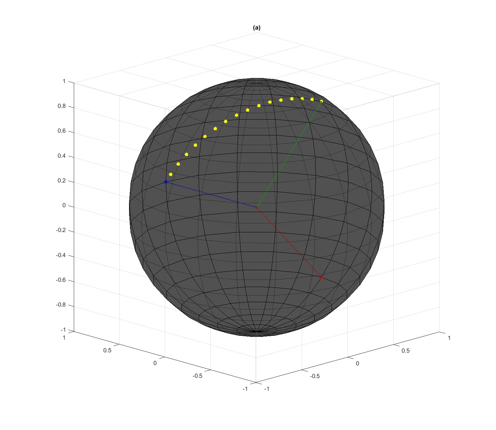

## ПОСТАНОВКА ЗАДАЧИ

**Дано:**  
1. Начальная точка $M_0(\phi_0, \lambda_0 )$ и конечная точка $M_1(\phi_1, \lambda_1 )$ на окружности ортодромии;
2. Модуль абсолютной путевой скорости $W$ точки $M_\tau(\phi_\tau, \lambda_\tau )$ при движении от $M_0$ до $M_1$
3. Абсолютная высота точки $H$ над сферой, равной среднему радиусу Земли.  

*Примечание:* $\phi_i, \lambda_i$ - Гео**Ц**ентрические координаты ($\lambda \equiv L$).  

**Найти:**  
 Координаты точки $M_i(\phi_i, \lambda_i )$ на интервале $t=(0, t_k)$ в ГИСК и ИСК.  

## СПРАВОЧНЫЕ МАТЕРИАЛЫ

## Пока получается вот так
